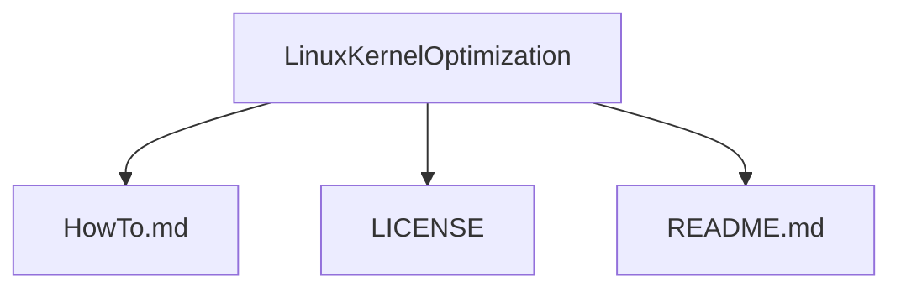

Public | Free OpenSource

# LinuxKernelOptimization
Linux kernel optimization - powerd by AI agents

Implementation with integrated memory, [Mistral](https://mistral.ai) AI, and [Agno](https://agno.com) Agents for **Linux kernel optimization**: [How to](./HowTo.md)

License: GNU-GPL3

---

